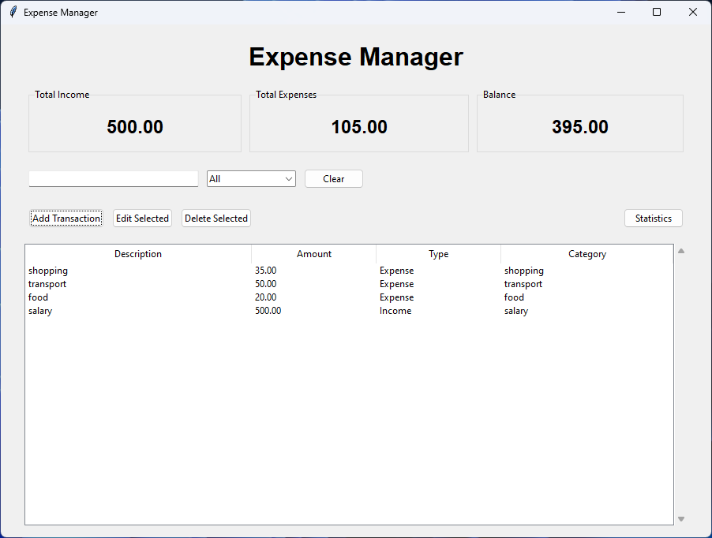
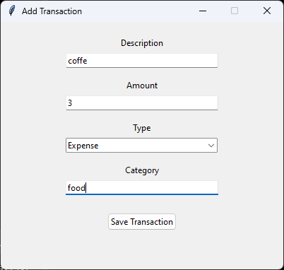
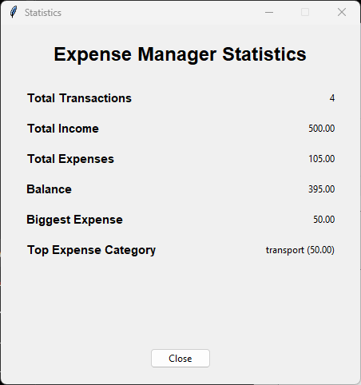

# Expense Manager

A desktop expense management application built with Python.

## Features

* Add income and expenses
* Edit and delete transactions
* Search transactions
* Filter by transaction type
* Automatic income, expenses, and balance calculation
* Statistics dashboard
* SQLite database for data persistence
* Simple and user-friendly GUI

## Technologies

* Python
* Tkinter
* SQLite

## Screenshots

### Dashboard



### Add Transaction



### Statistics



## How to Run

1. Make sure Python is installed.
2. Clone the repository.
3. Open the project folder.
4. Run:

```bash
python main.py
```

## Developer

Oday Almaqousi
